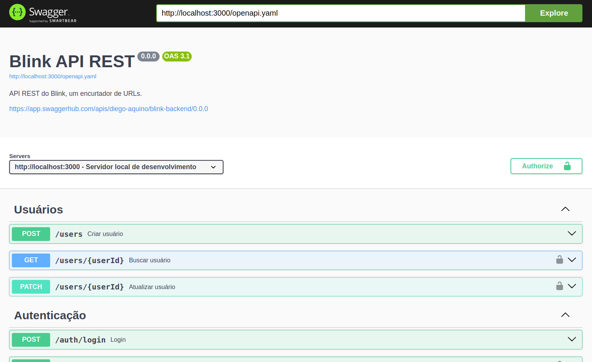

# Blink Backend

Blink é um encurtador de URLs que está sendo desenvolvido por [@diego-aquino](https://github.com/diego-aquino) durante a
disciplina de Programação Web 2 2024.1, no curso de Ciência da Computação da UFCG. Nesse sistema, uma URL encurtada é
chamada de _blink_.

Veja a [documentação da API](./docs/spec/openapi.yaml), também disponível no
[SwaggerHub](https://app.swaggerhub.com/apis/diego-aquino/blink-backend/0.0.0) ou em `http://localhost:3001` ao executar
o projeto.



## Executando o projeto

1. Clone o repositório:

   ```bash
   git clone git@github.com:diego-aquino/blink-backend.git
   cd blink-backend
   ```

2. Instale as dependências:

   ```bash
   npm install
   ```

3. Gere os tipos do Prisma:

   ```bash
   npx prisma generate
   ```

4. Inicie o banco de dados:

   ```bash
   npm run deps:up
   ```

5. Execute as migrations:

   ```bash
   npm run migration:apply
   ```

6. Inicie o servidor:

   ```bash
   npm run dev
   ```

O servidor estará disponível em `http://localhost:3001`.

## Executando os testes

1. Inicie o banco de dados:

   ```bash
   npm run deps:up
   ```

2. Execute os testes em modo `watch`:

   ```bash
   npm run test
   ```
