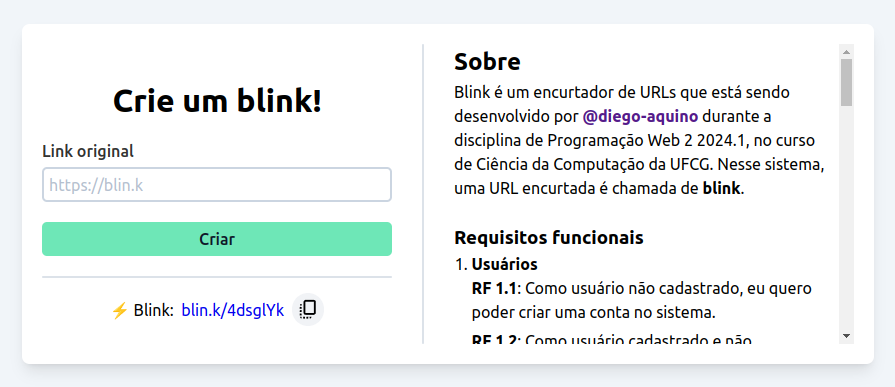

# Blink Backend

Blink é um encurtador de URLs que está sendo desenvolvido por [@diego-aquino](https://github.com/diego-aquino) durante a
disciplina de Programação Web 2 2024.1, no curso de Ciência da Computação da UFCG. Nesse sistema, uma URL encurtada é
chamada de _blink_.

## Requisitos funcionais

1. Usuários

- **RF 1.1**: Como usuário não cadastrado, eu quero poder criar uma conta no sistema.
- **RF 1.2**: Como usuário cadastrado e não autenticado, eu quero poder fazer login no sistema.
- **RF 1.3**: Como usuário cadastrado e autenticado, eu quero poder fazer logout do sistema.

2. URLs (blinks)

- **RF 2.1**: Como usuário autenticado, eu quero poder criar uma URL encurtada.
- **RF 2.2**: Como usuário autenticado, eu quero poder visualizar as URLs encurtadas que criei.
- **RF 2.3**: Como usuário autenticado, eu quero poder editar uma URL encurtada que criei.
- **RF 2.4**: Como usuário autenticado, eu quero poder remover uma URL encurtada que criei.
- **RF 2.5**: Como usuário qualquer na internet, possivelmente não cadastrado ou não autenticado no sistema, eu quero
  poder acessar uma URL encurtada e ser redirecionado para a URL original.
  - Deve ser realizado um redirecionamento HTTP 308 (Permanent Redirect) para a URL original.
  - Devem ser usados os headers `Cache-Control: public, max-age=0, must-revalidate` e `Location: {url-original}`.

## Requisitos não-funcionais

1. Segurança

- **RNF 1.1**: O sistema deve armazenar as senhas dos usuários de forma segura.
- **RNF 1.2**: O sistema deve garantir que um usuário possa listar, editar ou remover apenas as URLs encurtadas que ele
  criou.
- **RNF 1.3**: O sistema deve garantir que um usuário não autenticado não possa criar, visualizar, editar ou remover
  URLs encurtadas.
- **RNF 1.4**: O sistema deve utilizar um método de autenticação stateless para autenticar os usuários, com tokens JWT
  de acesso e refresh. Os tokens deve ser armazenados em cookies HTTP com os atributos `HttpOnly`, de modo a serem
  acessíveis apenas pelo servidor.

2. Usabilidade

- **RNF 2.2**: O sistema deve ser acessível, seguindo as diretrizes de acessibilidade.
- **RNF 2.3**: O sistema deve ser intuitivo, com uma interface de usuário amigável.

3. Desempenho

- **RNF 3.1**: O sistema deve ser capaz de redirecionar o usuário para a URL original de forma rápida, em menos de 100
  milissegundos em condições normais.
- **RNF 3.2**: O sistema deve realizar suas operações comuns em menos de 1 segundo em condições normais, como cadastro,
  login, logout, criação, listagem, edição e remoção de URLs encurtadas.
